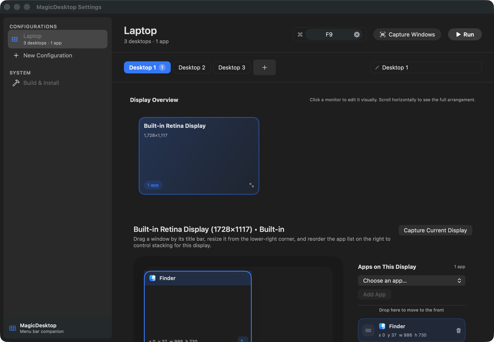

# MagicDesktop

MagicDesktop is a macOS menu bar app for saving and restoring full working layouts.

It can:

- launch apps that are not already running
- restore Finder and normal app windows onto specific monitors
- arrange layouts across multiple macOS Desktops
- apply windows in a saved front-to-back order
- trigger a configuration from the menu bar or a global shortcut
- rebuild and reinstall itself from a local clone

The app is an `LSUIElement` utility, so it lives in the menu bar and does not show a Dock icon.



## What A Configuration Contains

Each configuration is an ordered layout made of:

1. one or more saved macOS Desktops
2. one or more displays inside each desktop
3. one saved window layout per app bundle
4. an optional global shortcut slot

That means a configuration is not just "open these apps". It is "restore this desktop sequence, on these monitors, with this window order".

## How The App Works

When you run a configuration, MagicDesktop:

1. checks Accessibility permission
2. validates the current macOS Desktop environment
3. matches the configuration to the current Mission Control desktop stack
4. switches through the saved desktops in order
5. launches or reuses each target app
6. creates a Finder browser window when Finder needs one
7. moves the chosen window onto the target desktop
8. resizes and repositions the window on the target display
9. raises windows in saved order so later items end up on top

Saved frames are display-relative whenever a display is known, so layouts survive monitor rearrangement better than absolute screen coordinates.

## Settings Window

The settings window is a split view with two main areas.

### Sidebar

- `Configurations`: every saved layout
- `New Configuration`: creates another layout entry
- `Build & Install`: rebuilds and reinstalls the app from a local repo clone

### Configuration Editor

The editor is intentionally arranged from broadest scope to narrowest scope:

1. Header bar
   What you edit here:
   configuration name, shortcut, `Capture Windows`, and `Run`
2. Desktop bar
   What you edit here:
   desktop order, desktop selection, add desktop, rename desktop
3. Workspace
   What you edit here:
   display overview, per-display canvas, app stacking order, capture for a single display

## Editing A Layout

### 1. Create or select a configuration

Choose a configuration from the sidebar or create a new one.

### 2. Add desktops

Use the desktop chips above the workspace to model the Mission Control desktops you want the config to restore.

- Desktop order matters
- desktop names are saved and applied back to macOS where possible
- the selected desktop controls what the workspace is editing

### 3. Pick a display

The `Display Overview` shows the currently connected monitors in their relative arrangement.

- click a monitor to edit that display
- the overview is horizontally scrollable for large monitor layouts
- app counts on each monitor card show how many saved windows belong to that display on the selected desktop

### 4. Arrange windows visually

For the selected display, MagicDesktop shows:

- a canvas with draggable, resizable saved windows
- an app list on the right
- a front-to-back stacking order

You can:

- drag a saved window by its title bar
- resize it from the lower-right corner
- add an app to the selected display
- remove an app from the selected display
- reorder the app list to control which windows end up above others

The app list is not cosmetic. It controls the final raise order during restore.

### 5. Capture instead of placing manually

`Capture Windows` captures the currently visible restorable app windows from the active macOS desktop into the selected saved desktop.

`Capture Current Display` only refreshes the selected display on the selected saved desktop.

Capture is space-aware:

- MagicDesktop only captures windows that belong to the active macOS desktop
- it does not intentionally pull a different window for the same app from another desktop
- accessory and status-item panels are excluded because they are not reliably restorable through the normal activation flow

## Shortcuts And Running

Each configuration can be assigned one global shortcut slot.

- slot `1` maps to `Ctrl+Option+1`
- slot `2` maps to `Ctrl+Option+2`
- and so on through slot `9`

You can run a configuration in two ways:

- from the menu bar menu
- from its global shortcut

The `Run` button in the editor triggers the same activation flow immediately.

## Multi-Desktop Support

MagicDesktop now treats multiple Mission Control desktops as a first-class part of a configuration.

Important rules:

- desktops are restored sequentially in the order saved in the editor
- the machine must already have at least that many user desktops created in Mission Control
- MagicDesktop currently supports the shared global desktop stack only
- `Displays have separate Spaces` must be turned off in macOS settings

If the environment does not match those rules, MagicDesktop stops and shows an explicit error instead of partially restoring the configuration.

## Finder Support

Finder is handled specially because it often has no normal browser window until one is opened.

During restore, MagicDesktop will:

- detect when Finder is the target app
- open a real Finder browser window if needed
- wait for Accessibility to expose that window
- move and resize it like any other restorable window

This lets Finder participate in normal capture and restore flows instead of behaving like the desktop background.

## Build & Install

The `Build & Install` screen is a developer convenience pane inside the app.

It shows:

- the selected local clone path
- the running app version
- the repo version from `project.yml`
- the installed app version in `/Applications`

`Build Latest & Re-install` does the same workflow the project expects in development:

1. optionally regenerate the Xcode project with `xcodegen generate`
2. build the app with `xcodebuild`
3. stabilize the built app's code signature
4. replace `/Applications/MagicDesktop.app`
5. relaunch the installed build

This keeps the running app aligned with the code in your repo instead of leaving an old build in `/Applications`.

## Requirements

- macOS 14+
- Xcode 16+
- [XcodeGen](https://github.com/yonaskolb/XcodeGen)
- Accessibility permission in `System Settings > Privacy & Security > Accessibility`

## Build From Source

```bash
xcodegen generate
xcodebuild -project MagicDesktop.xcodeproj -scheme MagicDesktop -configuration Debug build
open MagicDesktop.xcodeproj
```

For normal local development, install the built app to `/Applications/MagicDesktop.app` and relaunch it so the running version matches the repo version.

## Data Storage

Configurations are stored at:

```text
~/Library/Application Support/MagicDesktop/configurations.json
```

The model now persists desktops explicitly, and older single-desktop configurations are migrated automatically into a one-desktop shape when loaded.

## Current Limitations

- one saved app layout currently maps to one target window per bundle identifier
- the same app should not be intentionally assigned to multiple saved desktops in one configuration
- MagicDesktop does not create missing Mission Control desktops yet; create them first
- accessory popovers and menu bar panels are not captured as restorable layouts
- window restore still depends on what each target app exposes through macOS Accessibility APIs

## Code Map

If you are working in the codebase, these files are the main entry points:

- `Sources/Services/SpaceManager.swift`
  desktop-aware activation flow, launch orchestration, Finder restore behavior
- `Sources/Services/DesktopManager.swift`
  Mission Control desktop enumeration, switching, naming, and window-to-desktop moves
- `Sources/Services/WindowManager.swift`
  Accessibility window discovery, frame capture, frame restore, and display-relative conversion
- `Sources/UI/ConfigurationEditorView.swift`
  multi-desktop configuration editor and capture UI
- `Sources/UI/SettingsView.swift`
  split-view settings window and sidebar routing
- `Sources/Services/BuildInstallService.swift`
  local build, reinstall, and version reporting
- `Sources/Models/SpaceConfiguration.swift`
  persisted configuration model, including desktop-level layout storage

## Why This Exists

MagicDesktop is for setups that are more structured than "reopen the last few apps".

If your work depends on repeating the same desktop sequence, monitor placement, Finder window, and front-to-back stack every day, this app turns that setup into something you can restore on demand.
